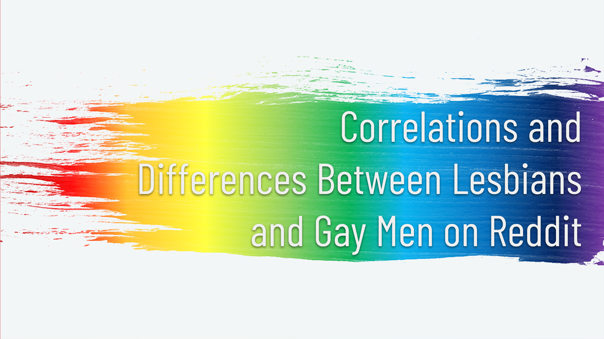

# Correlations and Differences Between Lesbians and Gay Men on Reddit

## Problem Statement
Lesbians have twice the divorce rate of gay men.  What correlations on Reddit can we use to identify causes and solutions?
## Data Gathering
I gathered all of my data from two reddit groups. There are GayMen (https://www.reddit.com/r/GayMen/) and actuallesbians (https://www.reddit.com/r/actuallesbians/). I obtained all my data with the Pushshift API, which involved two batches of 500 for each reddit group.
## Methods
Cleaning was fairly minimal to maintain as many words as possible. I converted the data from json to dataframes, and combined the dataframes.  I changed the subreddit column so that GayMen = 1 and actuallesbian = 0. I combined the selftext (the text in the post) and title (text in the title of the post) columns into a new column called text. This allowed me to have one X to compare with my one y variable. I used sklearn's stopwords and removed roughly 15 of their words that could be important in this study, primarily pronouns. 
## Modeling
I set X equal to the text column, and y to the subreddit column. I set up X_train, y_train, X_test, y_test and made my test size .33, stratified y, and created a random state of 42. For model 1, I created a ‘pipe’ with cvec and lr, for CountVectorizer() and LogisticRegression() respectively. The ‘pipe parameters’ included my stopwords, max_features of 500, 750, and 1000, min_df of 3, 5, and 9, and ngram_range of (1,1) and (1,2). And lastly, I created a GridSearchCV, which included the pipe, pipe parameters, and cv of 5. I repeated this process for my second model, the only difference being that my pipe used TfidfVectorizer(tvec) instead of cvec. My third model ran through the same pipe, with the exception of utilizing MultinomialNB (naive bayes) instead of logistic regression.

## Results
Model 1: I fit my X_train and y_train to my gridsearch and found the best estimator to be max_features=750, min_df=9, ngram_range=(1, 1). My train and test accuracy scores were .95 and .82, respectively. 
Model 2: max_features = 1000, min_df = 3, and ngram_range = (1,1). The train and test scores came back .9 each 
Model 3: best estimator was max_features = 1000, min_df= 3, and ngram_range = (1,1). The train score was .89 while the test score came back .81
## Conclusion
We can find significant differences in gay/lesbian subreddit text, but this study did not compare the exact words that were different between the two subreddits. Ultimately, comparing gay and lesbian Reddit language is perhaps useful for differentiating gay men from lesbians, but not the best way to diagnose problems within the lesbian community. A better method would be to conduct surveys with lesbians in marriages that have ended and lesbians in marriages that have lasted over x years and find trends.
## Data Dictionary
|Feature|Type|Dataset|Description|
|---|---|---|---|
|subreddit|int|df|1 = GayMen subreddit, 0 = actuallesbians subreddit|
|selftext|obj|df|body text of the reddit submission|
|title|obj|df|title text of the reddit submission|
|text|obj|df|combined body and title text of the reddit submission|

